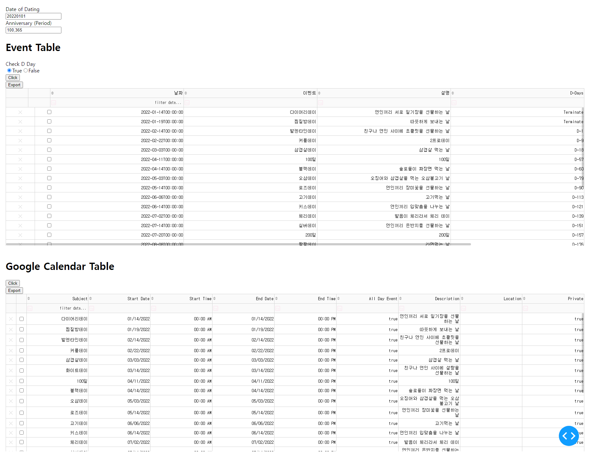

# PyKorAnniversary
파이썬을 활용하여 한국 기념일 관리하기

# Install

```
git clone https://github.com/sungreong/PyKorAnniversary.git
pip install -r requirements.txt
```
# Feature 

- [x]  한국 기념일 데이터
- [x]  특정 이벤트 추가하는 기능 
- [x]  구글 캘린더 데이터로 변환 기능

# UI

- [x] Dash를 사용하여 UI 구성



# Deploy

- [ ] [PythonAnywhere](https://www.pythonanywhere.com/)를 이용하여 배포 


# Google Calendar에 적용 방법

## 만들어진 csv를 바탕으로 업로드해서 사용하기

* https://dorudoru.tistory.com/1604

## Google Calnedar API 사용

API를 이용해서 바로 파이썬에서 구글 캘린더로 적용할 수 있음.

* credentials.json 만드는 방법 
  * [인증 방법 가이드](https://data-newbie.tistory.com/832)


